<p align="center">
  <picture>
    <source media="(prefers-color-scheme: dark)" srcset="docs/assets/hero-dark.png">
    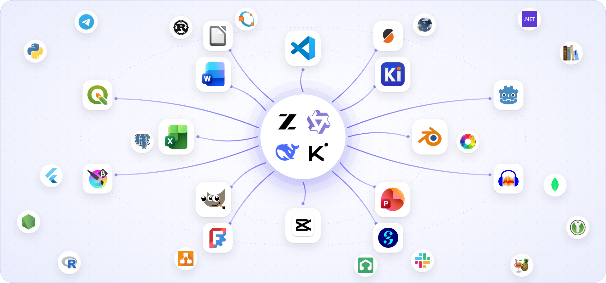
  </picture>
</p>

<h1 align="center">AI PC</h1>

<p align="center">
  An assistant for Windows that works inside your desktop programs through code.<br>
  It writes each program's own files, or calls its official interface, and the program renders the result.
</p>

<p align="center">
  <a href="https://github.com/FareedKhan-dev/ai-pc/actions/workflows/ci.yml"></a>
  
  
  
  
</p>

<p align="center">
  <a href="#why-not-screenshots-and-clicks">Why</a> ·
  <a href="#how-it-works">How it works</a> ·
  <a href="#the-programs">Programs</a> ·
  <a href="#where-the-language-model-fits">Models</a> ·
  <a href="#getting-started">Getting started</a> ·
  <a href="docs/README.md">Docs</a>
</p>

You ask in plain words, typed or spoken. AI PC hands the request to the program that can do it: JianYing renders the
video, Word lays out the report, Blender renders the house, KiCad exports the schematic. The program runs where you
cannot see it, so you keep using the PC. Its output is measured before you get a reply, and every change is saved as a
version that "undo" can take back.

<table>
  <tr>
    <td width="50%">
      <picture>
        <source media="(prefers-color-scheme: dark)" srcset="docs/assets/screens/bar-reply-dark.png">
        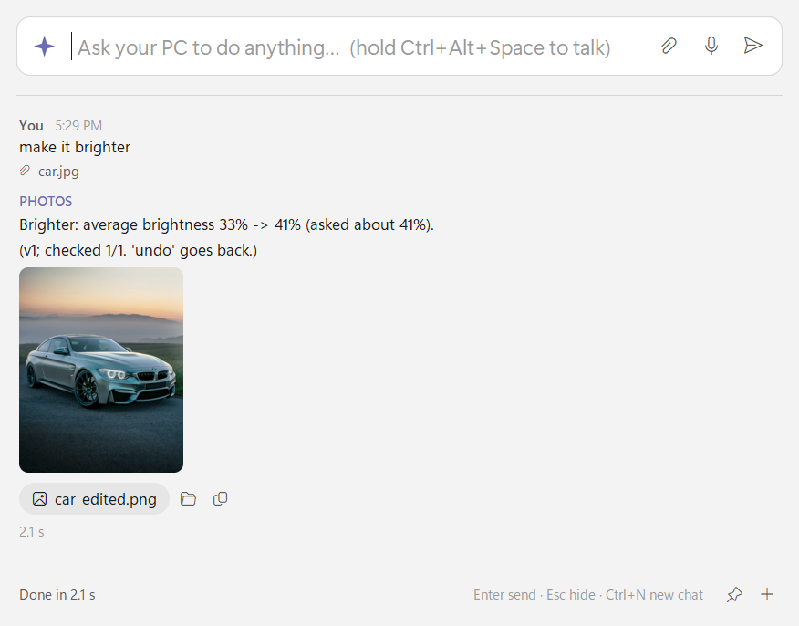
      </picture>
    </td>
    <td width="50%">
      <picture>
        <source media="(prefers-color-scheme: dark)" srcset="docs/assets/screens/bar-confirm-dark.png">
        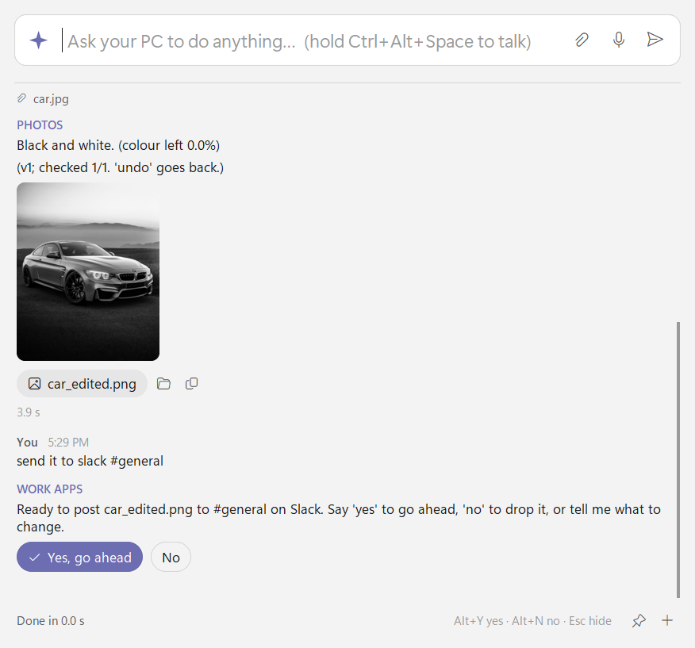
      </picture>
    </td>
  </tr>
  <tr>
    <td><sub>A photo is selected in File Explorer. Press Ctrl+Alt+Space and type "make it brighter". The photo program measures the picture (33% average brightness), brightens it, measures again (41%) and saves version 1.</sub></td>
    <td><sub>After a spoken "make it black and white", "send it to slack #general" means the edited photo. Nothing leaves the PC until you press Yes; the post is then read back from the channel.</sub></td>
  </tr>
</table>

<sub>Both pictures come from the bar's integration test, which runs the real bar on a hidden desktop with a stand-in for Slack.</sub>

## Contents

- [What you can ask for](#what-you-can-ask-for)
- [Why not screenshots and clicks?](#why-not-screenshots-and-clicks)
- [How it works](#how-it-works)
- [Where the language model fits](#where-the-language-model-fits)
- [Ways to ask](#ways-to-ask)
- [The programs](#the-programs)
- [Safety and privacy](#safety-and-privacy)
- [Measured results](#measured-results)
- [Getting started](#getting-started)
- [Under the hood](#under-the-hood)
- [Development](#development)

## What you can ask for

A few requests from the program pages, and what happens to each:

| You say | What AI PC does | What it checks before replying |
|---|---|---|
| "edit this for instagram: lightning on my eye, shaky boss entrance", with three clips | Plans the edit, writes a JianYing project with pyJianYingDraft, and lets JianYing export it in the background | A frame at each edit's own moment (about 25 in a 15-second reel), and a report of what you asked against what was delivered |
| "a 5 page report on rooftop solar for homes in Lahore with a cost table and a chart" | Writes the .docx with python-docx; Word renders it to PDF in its own invisible instance | The page count against the length asked, the font of every glyph in the PDF, the contents page against the real page numbers |
| "marks sheet in Excel for 8 students with totals, grades and a class summary" | Writes the workbook with real formulas; Excel recalculates it | Every total Excel computes equals the same total computed in Python, and no cell shows an error |
| "a 5 marla house with 3 bedrooms", then "make it double story" | Plans the rooms, writes an AutoCAD DXF with ezdxf, and prints the sheets at true scale | The DXF read back: it audits clean, every room can be reached, every room's name sits inside that room |
| "make my house plan 3D", then "show it from the street" | Builds the scene from the same plan in Blender, in background mode | A floor for every room and glass in every window; each picture shows the whole building |
| "kicad 555 blinker 2 hz on 9v" | Writes the schematic with KiCad's own library symbols; kicad-cli exports it | ERC clean, KiCad's netlist exactly as designed, a BOM and a PDF |
| "slice cube 20 mm for ender 3 in pla, 20% infill" | Runs PrusaSlicer's command line with PrusaSlicer's own printer profiles | The model sits on the bed at the height asked; print time and filament come back |
| "clean it up", with interview.wav | Measures the recording, then picks FFmpeg filters for rumble, hum, noise, level and loudness | Noise lower while the voice keeps its level, hum gone, loudness within 1 LU of the target |
| "post eid.mp4 to instagram reels, facebook and youtube shorts" | Makes a version for each platform, shows them, and posts through each official API after your yes | Each post read back from its platform |
| "invoice for Ali Traders: 2 LED TV 55 at 85,000 each, 18% tax", then "send everything to tally" | Keeps double-entry books on the PC and sends the invoice through TallyPrime's XML gateway | The invoice read back from TallyPrime, total for total, and never sent twice |

## Why not screenshots and clicks?

Most computer-use agents operate a PC the way a person would over a remote desktop. They take a screenshot, send it to
a vision-language model, get back one action (a click at x, y, or some typing), perform it, wait for the program to
react, and take the next screenshot. Every action costs a model call that carries a picture:

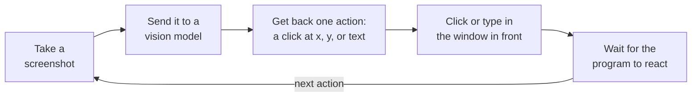

AI PC goes the other way round. It changes the program's data, lets the program draw the result, and measures it, in
one pass per request:

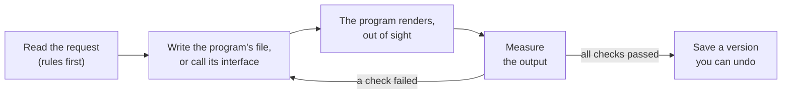

The screen loop works on any program a person can see, which is why it is popular, and it has improved quickly. On
OSWorld-Verified, a benchmark of short desktop tasks on Linux, the best agents scored 86 to 90% in August 2026, above
the 72% that people new to the software reached when the benchmark was made.[^osworld][^osworld-verified] Where it still
falls short is speed, cost and long professional work, which is most of what people do in desktop programs:

| What was measured | Result | Source |
|---|---|---|
| Steps taken against steps needed | Even the best agents take 2.7 to 4.3 times more steps than necessary | OSWorld-Human, 2026[^osworld-human] |
| Time per task | Tens of minutes for tasks people do in a few. Changing a document's line spacing took an agent 12 minutes; a person needs under 30 seconds | OSWorld-Human[^osworld-human] |
| Where the time goes | Model calls for planning and reflection: 76 to 96% of the time per task. Taking screenshots and clicking: under 2% each | OSWorld-Human[^osworld-human] |
| Later steps | Up to 3 times slower than the first steps, because each prompt carries the earlier screenshots | OSWorld-Human[^osworld-human] |
| Against human experts | 5 to 50 times longer on GIMP, LibreOffice and similar tasks: 162 to 1,260 s per task against 11 to 48 s | OSExpert, 2026[^osexpert] |
| One 1080p screenshot | About 1,100 to 2,500 input tokens, depending on the model, sent again at every step | OpenAI and Google API docs[^openai-vision][^gemini-res] |
| Finding a button in professional software | Targets cover 0.07% of the screen on average. At release GPT-4o hit 0.8% of them; the best system on the leaderboard now hits 85%, using 2.6 model calls per target | ScreenSpot-Pro[^screenspot-pro] |
| Office programs on Windows, from screenshots | 0 to 7.1% of LibreOffice tasks done, for every model tested | WindowsAgentArena-V2, 2025[^waa-v2] |
| Long professional workflows (about 1.6 hours for a person) | The best agent finished 20.6%. No model finished any task that takes a person over 163 minutes | OSWorld 2.0, 2026[^osworld2] |

Some of it comes with the loop itself, whatever the model. A picture of a timeline does not say whether the exported
video has the effect at 7.2 seconds, and a picture of a spreadsheet does not say whether its totals are right. The agent also
needs the screen, the mouse and the keyboard while it works, and OSWorld's authors found that simply moving, resizing
or cluttering windows makes agents fail far more often.[^osworld]

### What we saw ourselves

AI PC started as a screen-driving agent. On 1 October 2026 it was asked to "open CapCut, add the video ... to a new
project, apply any free (non-Pro) filter to it, and export it". CapCut draws its own controls, so Windows' UI
Automation sees an empty window and only the screenshot is left. One run made 32 steps and 13 model calls, then gave up
after 155 seconds with nothing exported. Another stopped after 20 model calls and 253 seconds. The planning calls
carried screenshots, about 2,300 to 3,200 input tokens per call, and the calls crossed from Pakistan to a provider in the
EU. In the first run the model calls took 95 of the 155 seconds:

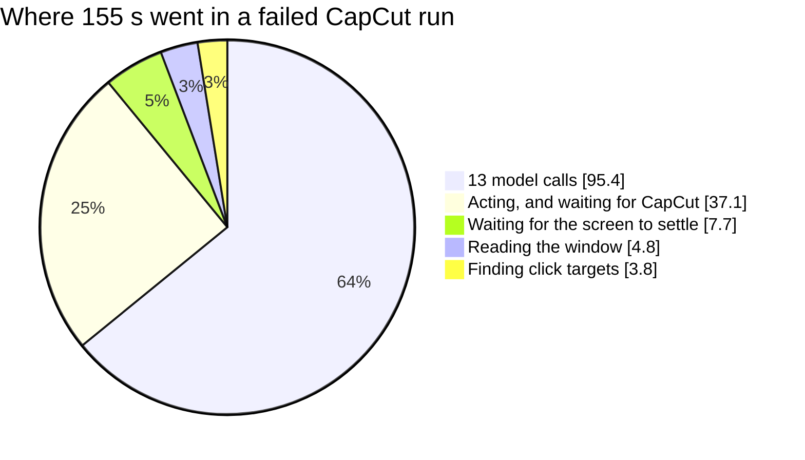

By code, video goes through JianYing, CapCut's sister program, whose project files pyJianYingDraft can write.
Writing the project takes under a second, and JianYing exports a 15-second reel in the background in 25 to 40 seconds.
A whole reel cut from three clips, with about 25 edits each checked at its own moment, takes 125 to 190 seconds,
including two rounds of repairs.

### Screen driving and AI PC side by side

| | A screen-driving agent | AI PC |
|---|---|---|
| What the model produces | One click or keystroke per call | A plan with names, numbers and times, once per request; no call at all when the rules can read the request |
| Model calls per task | One per step, tens per task | Usually none or one; a few for open-ended writing |
| Where the program runs | On your screen, in front of your work | On a hidden Windows desktop, in an invisible instance, or in background mode |
| Your mouse and keyboard | Taken while it works | Left alone |
| How it knows it worked | Another screenshot | It measures the output: frames at each edit, the rendered PDF, Excel's recalculated totals, a read-back from the service |
| Doing the job again | The same cost and the same risk again | The same code gives the same result, as a new version |
| What each program needs first | Nothing: anything on the screen | A writer for its file format, or a wrapper for its command line or API, and checks for its output |

### What it costs

Each program needs work up front: a writer for its file format, or a wrapper for its command line or API, and checks
for what it produces. That is why AI PC covers about a hundred programs and services rather than every program on
Windows. A program that offers no file format, command line or API goes to the desktop agent (`ai-pc agent`). It reads
the window through Windows UI Automation and uses a click model on screenshots only when the window exposes nothing.
After a clean run it saves the steps as a skill that replays without a model: a six-step Calculator task replays in 56
to 64 ms.

Research points the same way. Microsoft's UFO2 notes that selecting and formatting Excel cells one at a time "can often
be collapsed into a single API call".[^ufo2] An agent that can also run code reached 60.76% on OSWorld in about 10 steps
per task, where a screen-only agent needed 15; with code alone it reached 35.73%, because many tasks still need the
interface.[^coact] And in OSWorld 2.0, an agent asked to model a part in FreeCAD stopped clicking
and wrote a Python script in FreeCAD's console.[^osworld2]

## How it works

### Overview

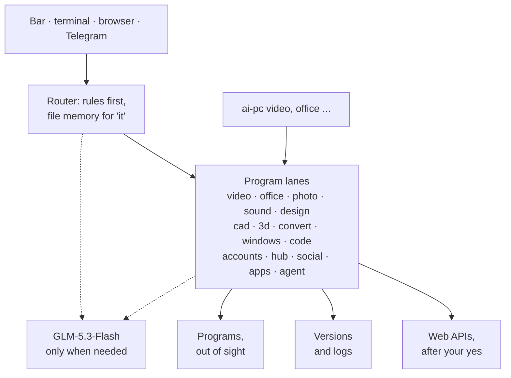

A request comes in through one of the ways to ask. The router reads it with rules: the words that name a program or its
work, the kinds of files attached, what each of the 88 smaller programs recognises by its own rules, and the
conversation so far ("make it stronger" stays with the video). The file memory turns "it", "this video", "the original"
and "the plan" into real files. The model is asked only when the rules cannot tell.

Each program lane is a package of its own: rules for its requests, a builder that writes files or calls an interface, a
renderer, checks, and a conversation with versions. Lanes share the model client, the media helpers (audio, speech,
frames) and the core (paths, keys, the hidden desktop, the headless browser), and nothing else. The
[architecture page](docs/architecture.md) has the details.

### One request, start to finish

The two requests from the screenshots above, step by step (the voice note between them is left out):

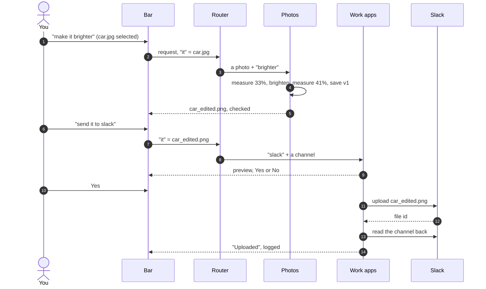

No model was called for any of these steps: the rules read every message. The bar's integration test runs these steps
and checks that the bytes Slack received are the edited photo, not the original.

### Five ways into a program

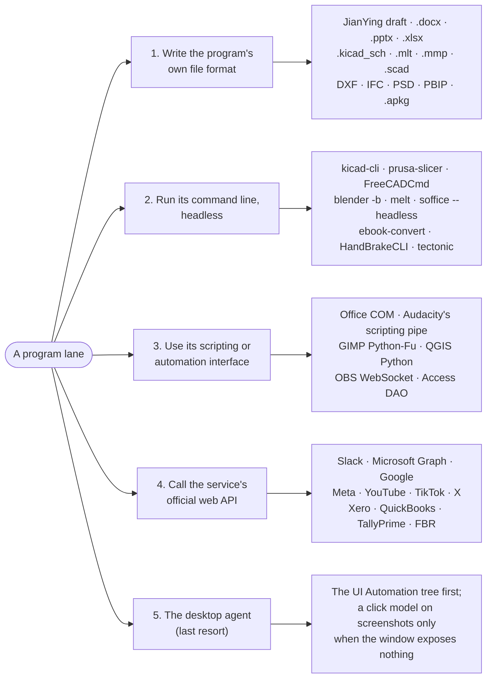

They are listed in the order AI PC prefers them, and most lanes combine the first two: the code writes the project, and
the program's own command line turns it into the finished file.

| Way in | When it is used | Examples |
|---|---|---|
| 1. The program's own file | The format is documented, or a library writes it | JianYing drafts (pyJianYingDraft), Word, PowerPoint and Excel (python-docx, python-pptx, openpyxl), KiCad schematics with KiCad's own symbols, Shotcut .mlt, LMMS .mmp, OpenSCAD .scad, AutoCAD DXF (ezdxf), IFC for Revit and ArchiCAD (ifcopenshell), layered PSD, Power BI projects, Anki decks, Lightroom .xmp presets, Premiere XML and FCPXML timelines, Microsoft Project XML, Visio .vsdx |
| 2. Its command line | The program can render or export without a window | kicad-cli, PrusaSlicer, FreeCADCmd, Blender in background mode, melt (Shotcut's engine), LibreOffice headless, ebook-convert, HandBrakeCLI, Tectonic, rawtherapee-cli, `lmms render`, MuseScore, draw.io's exporter, Rscript, octave-cli, compilers and test runners |
| 3. Its scripting interface | The program offers one, and it is the reliable way in | Word, PowerPoint and Excel through COM (render, measure, recalculate), Audacity through mod-script-pipe, GIMP through Python-Fu, QGIS through its own Python, OBS Studio through obs-websocket, Access databases through DAO |
| 4. The service's official API | The service is online | Slack, Microsoft 365, Google Workspace, Figma, Canva, Facebook, Instagram, Threads, YouTube, TikTok, LinkedIn, X, Xero, QuickBooks, Zoho Books, FBR, TallyPrime's XML gateway, Shopify, WooCommerce |
| 5. The desktop agent | Nothing above exists | Any Windows program, through UI Automation and, if needed, a click model; see [the desktop agent](docs/desktop-agent.md) |

### Running programs out of sight

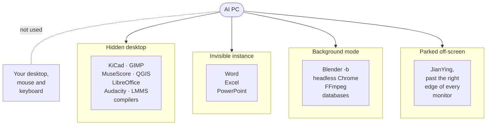

Programs that open a window even from their command line run on a second Windows desktop that is never shown
([`core/hidden_desktop.py`](src/ai_pc/core/hidden_desktop.py)). They start inside a job object, so on a timeout
everything they started is ended, and no window, splash screen or error box can reach your screen. Word, Excel and
PowerPoint run as a separate invisible instance, so documents you have open are never touched. Blender and Chrome run
in their own background modes, with Chrome's profile kept inside the project. Databases run on 127.0.0.1, on a free
port, for the length of the job.

### Checks, repairs and versions

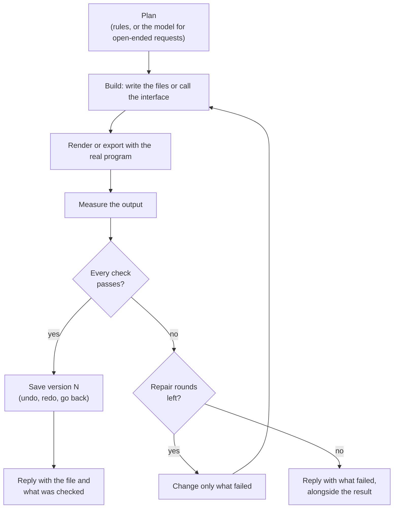

Each lane measures what it made, on the output itself:

| Lane | Measured after rendering |
|---|---|
| Video | A frame at each edit's own moment; the speed of each slot; what was asked against what was delivered |
| Word | Pages against the length asked; every glyph's font, read from the PDF; contents page numbers against the real pages; tables inside the margins |
| PowerPoint | PowerPoint's own measurement of every text box after layout, so overflowing text is caught |
| Excel | Excel recalculates; every total and metric equals the same number computed in Python |
| Photos | The measure that was asked for, before and after: brightness, colour left, faces, size on disk |
| Sound | Loudness (EBU R128) within 1 LU of the target; noise lower while the voice keeps its level; hum gone |
| CAD | The DXF read back: it audits clean, walls are closed, every room's name sits inside that room, every room can be reached |
| 3D | A silhouette render of the subject alone shows it in view and not cut off |
| Converter | The file plays through; the size limit is kept; VMAF against the original |
| Code | Every file compiles, the project's tests pass, the program runs; a web page loads with no console errors |
| Services | Every post, invoice, card and message is read back from the service |

The test suites also feed each check results spoiled on purpose (an overlong name on a card, text the colour of its
background, a QR code that reads as the wrong link, a plan where a room has no door) to make sure the check trips.
While the lanes were built, the checks caught real faults, for example:

- An edit plan where sub-millisecond rounding dropped 7 of 17 clips and left the video black.
- Making a kitchen 2 inches bigger cost a bedroom its door.
- Noise reduction with noise tracking turned on removed under 1 dB; a fixed floor just above the measured one removes 16 to 26 dB.
- Auto-enhance on a green-screen frame darkened the presenter's face.
- White text on a pale sunset gradient read at a contrast of 1.5:1.

Every change becomes a version: drafts are named per version, the coding lane keeps a git history per project, and file
operations on Windows go to the Recycle Bin and into a journal. "Undo", "redo", "go back to v2" and "history" work in
every lane.

### Asking before anything goes out

Anything other people will see waits for your yes: a Slack post, an email, a social media post, an invoice sent to an
accounting system, a shared file. The preview says exactly what goes where, "no" drops it, and "change the text to ..."
edits the draft. Emails are drafts first. After sending, each action is read back from the service, written to an
audit log, and undone on request where the service allows it.

## Where the language model fits

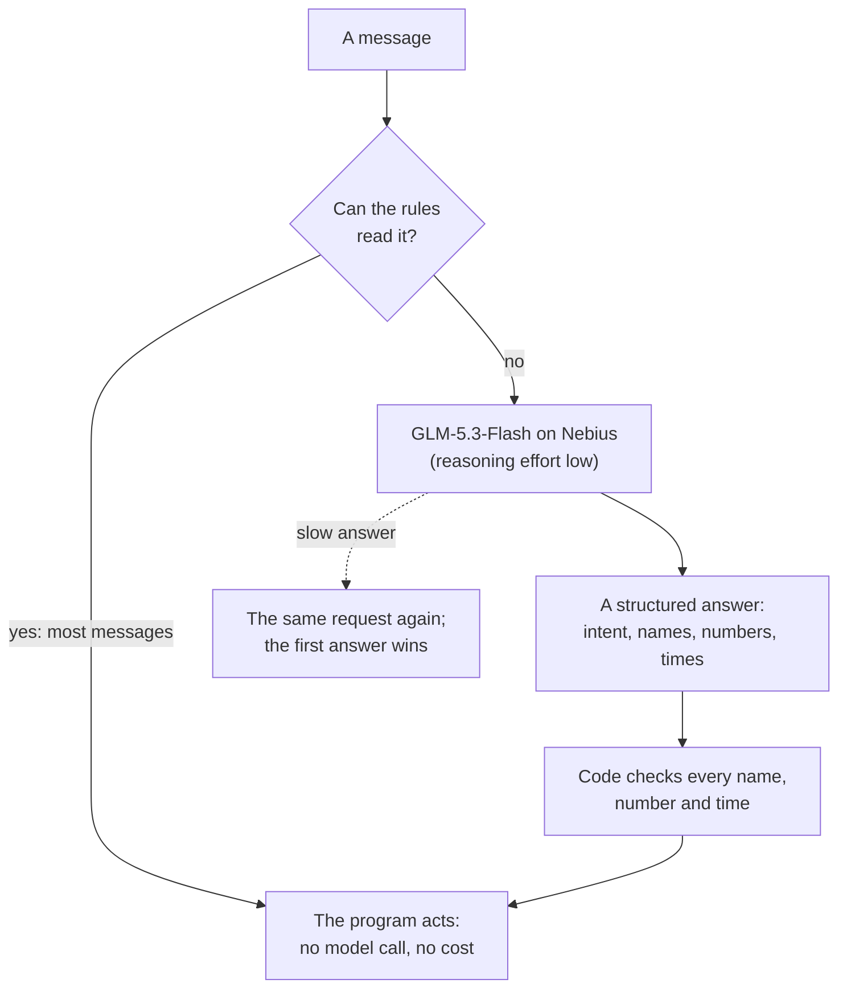

Rules do most of the reading, and the model is the fallback. Every lane reads requests with its own rules first, and
the chat routes by rules. The model is asked when the rules cannot tell, for open-ended writing (a report's sections, a caption), for plans
(an edit, a slide deck), and for some vision checks. In most lanes it returns a plan or text, and code turns that into
the file format; in the coding lane it writes the source files, and the checks run them.

Measured share of model calls in the lanes' conversation tests:

| Conversation test | Turns read by rules | Turns that needed the model | Model cost |
|---|---|---|---|
| Photos: 8 conversations | 36 of 38 | 2, about 2 s each | $0.0002 |
| Windows files and settings | 35 of 37 | 2 | $0.0007 |
| House plans (CAD) | 42 of 44 | 2 | $0.0003 |

In the video lane's chat-editing tests (296 turns), the model reads 5 to 10% of the turns, and a turn takes 0.5 to 1.2 s.

Every role runs on GLM-5.3-Flash, the cheapest model on the Nebius account that also reads images ($0.15 per million
input tokens and $0.50 per million output tokens, checked 2 October 2026). The choice came from
[`scripts/bench_models.py`](scripts/bench_models.py), which runs the real prompts against each candidate: on six real
CapCut screens GLM-5.3-Flash was right 6 times out of 6 in 1.6 to 2.7 s, while DeepSeek-V4.1-Flash was also right 6 out
of 6 but took 3.9 to 64 s. Provider latency has long tails (the same DeepSeek model's median went from 2 to 3.5 s up to
39.8 s on 1 October 2026), so a slow call gets a second, identical request and the first answer wins. The role-to-model
table is in [`core/config.py`](src/ai_pc/core/config.py), and any model on the account can take a role.

<table>
  <tr>
    <td align="center" width="150"><br><sub>GLM-5.3-Flash</sub><br><sub><sup>every role</sup></sub></td>
    <td align="center" width="150"><br><sub>Qwen3.8-27B</sub><br><sub><sup>the earlier fast planner</sup></sub></td>
    <td align="center" width="150"><br><sub>DeepSeek-V4.1-Flash</sub><br><sub><sup>the earlier vision planner</sup></sub></td>
    <td align="center" width="150"><br><sub>Kimi-K3</sub><br><sub><sup>the earlier deep planner</sup></sub></td>
  </tr>
</table>

Some models run on the PC itself:

| Model | Runs on | Used for |
|---|---|---|
| Whisper base (faster-whisper) | CPU | Voice notes, captions, finding "um" and "uh" to cut |
| YuNet | CPU (OpenCV) | Faces in photos, framing in videos |
| Vocaela-2-500M | The Intel Arc GPU, through llama.cpp (Vulkan) | Desktop agent clicks: 29 of 30 CapCut targets found (weights CC BY-NC-SA, non-commercial) |
| TinyClick (0.23B) | The Intel Arc GPU (PyTorch XPU) | Desktop agent clicks, the alternative: 18 of 30 |

## Ways to ask

| Way | Start it with | Notes |
|---|---|---|
| The command bar | `ai-pc bar`, or double-click `AI PC.lnk` | Ctrl+Alt+Space opens it over any program (58 to 86 ms from the keys to the bar, measured). Hold the keys and talk; Whisper on the PC transcribes it. Files selected in File Explorer, or the document open in Word, Excel or PowerPoint, come along as "it". Yes and No are Alt+Y and Alt+N. |
| The terminal | `ai-pc chat` | The same chat. A line that is a file path sends the file; `--voice note.m4a` sends a voice note; `--resume` carries on, with "it" still meaning what it meant. |
| A browser page | `ai-pc web` | Served on 127.0.0.1 only. Each run has a secret the page sends with every request, so another web page cannot drive the chat. |
| Your phone | `ai-pc telegram` | Through your own Telegram bot. Only your chat is listened to; files made come back, up to Telegram's 50 MB. |
| One program | `ai-pc video`, `ai-pc office`, `ai-pc cad` ... | Each program's own command, with `--help`. |

The bar uses a Windows hotkey (RegisterHotKey), not a keyboard hook, so nothing watches your typing. The microphone is
open only while you hold the keys or the mic button is on. It follows your light or dark setting and accent colour.

<picture>
  <source media="(prefers-color-scheme: dark)" srcset="docs/assets/screens/bar-open-dark.png">
  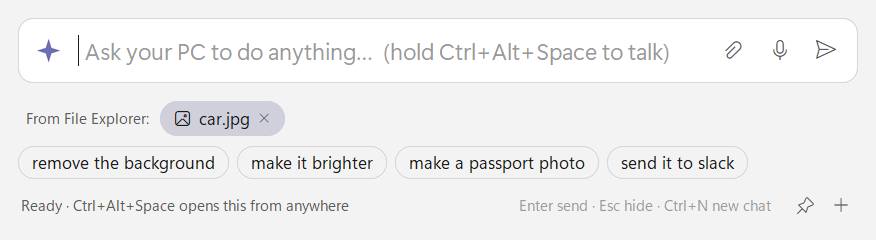
</picture>

## The programs

Each program below is driven by one of the five ways in. Programs that are not installed the usual way live as
portable copies in the project's `tools/` folder; each was downloaded from its publisher and checked against the
published checksum, and against the signature where the publisher signs. `ai-pc doctor` lists every one with its
version.

### Video and sound

<table>
  <tr>
    <td align="center" width="96"><br><sub>JianYing</sub></td>
    <td align="center" width="96"><br><sub>CapCut</sub></td>
    <td align="center" width="96"><br><sub>Shotcut</sub></td>
    <td align="center" width="96"><br><sub>HandBrake</sub></td>
    <td align="center" width="96"><br><sub>FFmpeg</sub></td>
    <td align="center" width="96"><br><sub>Audacity</sub></td>
    <td align="center" width="96">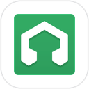<br><sub>LMMS</sub></td>
    <td align="center" width="96"><br><sub>MuseScore</sub></td>
    <td align="center" width="96"><br><sub>OBS Studio</sub></td>
  </tr>
</table>

### Documents and office

<table>
  <tr>
    <td align="center" width="96"><br><sub>Word</sub></td>
    <td align="center" width="96">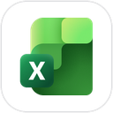<br><sub>Excel</sub></td>
    <td align="center" width="96">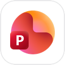<br><sub>PowerPoint</sub></td>
    <td align="center" width="96">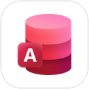<br><sub>Access</sub></td>
    <td align="center" width="96"><br><sub>LibreOffice</sub></td>
    <td align="center" width="96"><br><sub>Power BI</sub></td>
    <td align="center" width="96"><br><sub>Calibre</sub></td>
  </tr>
</table>

### Pictures and design

<table>
  <tr>
    <td align="center" width="96"><br><sub>GIMP</sub></td>
    <td align="center" width="96"><br><sub>Krita</sub></td>
    <td align="center" width="96"><br><sub>RawTherapee</sub></td>
    <td align="center" width="96"><br><sub>draw.io</sub></td>
    <td align="center" width="96"><br><sub>Figma</sub></td>
  </tr>
</table>

### 3D, CAD and making

<table>
  <tr>
    <td align="center" width="96"><br><sub>Blender</sub></td>
    <td align="center" width="96"><br><sub>FreeCAD</sub></td>
    <td align="center" width="96"><br><sub>OpenSCAD</sub></td>
    <td align="center" width="96"><br><sub>PrusaSlicer</sub></td>
    <td align="center" width="96"><br><sub>KiCad</sub></td>
    <td align="center" width="96">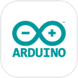<br><sub>Arduino</sub></td>
    <td align="center" width="96">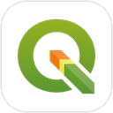<br><sub>QGIS</sub></td>
    <td align="center" width="96"><br><sub>Godot</sub></td>
  </tr>
</table>

### Code and data

<table>
  <tr>
    <td align="center" width="96"><br><sub>VS Code</sub></td>
    <td align="center" width="96">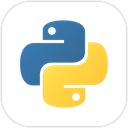<br><sub>Python</sub></td>
    <td align="center" width="96"><br><sub>Node.js</sub></td>
    <td align="center" width="96"><br><sub>PHP</sub></td>
    <td align="center" width="96"><br><sub>.NET</sub></td>
    <td align="center" width="96">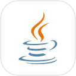<br><sub>Java</sub></td>
    <td align="center" width="96"><br><sub>Go</sub></td>
    <td align="center" width="96"><br><sub>Rust</sub></td>
  </tr>
  <tr>
    <td align="center" width="96"><br><sub>Flutter</sub></td>
    <td align="center" width="96"><br><sub>Android</sub></td>
    <td align="center" width="96">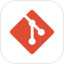<br><sub>Git</sub></td>
    <td align="center" width="96"><br><sub>PostgreSQL</sub></td>
    <td align="center" width="96"><br><sub>MySQL</sub></td>
    <td align="center" width="96"><br><sub>MongoDB</sub></td>
    <td align="center" width="96"><br><sub>R</sub></td>
    <td align="center" width="96"><br><sub>GNU Octave</sub></td>
  </tr>
</table>

### Windows, work apps and online services

<table>
  <tr>
    <td align="center" width="96"><br><sub>7-Zip</sub></td>
    <td align="center" width="96"><br><sub>KeePassXC</sub></td>
    <td align="center" width="96"><br><sub>AutoHotkey</sub></td>
    <td align="center" width="96"><br><sub>Slack</sub></td>
    <td align="center" width="96"><br><sub>Telegram</sub></td>
    <td align="center" width="96"><br><sub>WhatsApp</sub></td>
    <td align="center" width="96"><br><sub>Teams</sub></td>
    <td align="center" width="96"><br><sub>Gmail</sub></td>
  </tr>
</table>

Also through their official APIs: Microsoft 365 (Outlook, Calendar, OneDrive), Google (Calendar, Drive, Sheets, Docs,
Slides, Forms), Trello, Asana, Notion, Jira, HubSpot, Zoom, Facebook, Instagram, Threads, YouTube, TikTok, LinkedIn,
X, QuickBooks Online, TallyPrime, Xero, Zoho Books, FBR Digital Invoicing, Shopify, WooCommerce, Daraz, WordPress,
Odoo, Mailchimp, Brevo, Dropbox, Discord, Spotify, Salesforce and GitHub. Windows itself (files, folders, the Recycle
Bin, settings, OCR, printing, updates through winget) is a lane of its own.

<details>
<summary><b>How each program is driven, and what is checked</b></summary>

| Program | Driven by | Result and checks |
|---|---|---|
| JianYing 5.9 | Project written with pyJianYingDraft; JianYing exports it with its windows parked off-screen | A frame at each edit's moment; speed per slot; asked against delivered |
| CapCut | Drafts written with pyCapCut into CapCut's project list | The plan is validated before the draft is written: free items only, times and names |
| Shotcut | .mlt projects rendered by its engine, melt | Length, sound, each cut showing the right moment, the title read back |
| HandBrake | HandBrakeCLI with its official presets | Same length, size limit kept, the preset's frame size, sound kept |
| FFmpeg | Every conversion, sound edit and screen recording; Intel GPU encoders where they help | Plays through; size limit; VMAF against the original; loudness |
| Audacity | The real Audacity on the hidden desktop, through its scripting pipe | Loudness, pauses and length, measured by FFmpeg |
| LMMS | .mmp projects rendered by `lmms render` | Length and sound, measured by FFmpeg |
| MuseScore | Its command line: MusicXML or MIDI to .mscz, PDF, PNG and MP3 | MuseScore's own score report, the PDF title, the note count, the MP3 length |
| OBS Studio | obs-websocket v5 | Scenes, sources, recording and screenshots; streaming only after a yes |
| Premiere Pro, DaVinci Resolve, Final Cut Pro | Timeline files: Premiere XML, FCPXML 1.10, CMX 3600 EDL, OpenTimelineIO | Clips and in/out points at the first clip's frame rate and size |
| Word, PowerPoint, Excel | python-docx, python-pptx and openpyxl write; Office renders through COM | Pages, glyph fonts, contents page, text overflow measured by PowerPoint, totals recalculated by Excel |
| Access | DAO, Access's own engine, with no window | Tables from Excel or CSV; read-only SQL answers |
| LibreOffice | soffice --headless on the hidden desktop | Conversions keep the original's words; Calc gives every formula a value and none an error |
| Power BI | A Power BI Project (PBIP): model, DAX measures, a report page | Checked against Microsoft's published JSON schemas |
| Microsoft Project | MSPDI XML and an Excel Gantt chart | Working days, the critical path and slack; no loops |
| Calibre | ebook-convert and ebook-meta | Each result opens as its format and holds the original's words |
| LaTeX (Tectonic) | Tectonic on the hidden desktop | Page count, title, every heading, no unresolved references |
| Anki | .apkg decks written with genanki | Read back from the package's own database |
| GIMP | Its Python batch mode on the hidden desktop | Every result measured; layered .xcf reopened by GIMP |
| Krita | OpenRaster written by code; Krita makes its own .kra and renders it | Krita's render matches the layers |
| Photoshop | Layered PSD written by code | Named, movable layers |
| Illustrator | Layered SVG and a print PDF | Named layers, editable text |
| Lightroom | .xmp develop presets; the same look applied here | Each finished JPEG checked: brighter, warmer, grey, darker corners |
| RawTherapee | rawtherapee-cli with a .pp3 profile written from words | Each change measured against the original: brightness, colour, warmth, detail, same size |
| draw.io | draw.io's own exporter | Windows OCR reads every box label |
| Visio | .vsdx written by code | LibreOffice's Visio reader turns it into a PDF |
| Figma, Canva | Figma's REST API and Canva's Connect API, into an HTML and CSS project | Every element within 3 px of the design; every text present; every font loads |
| Blender | A Python script run by Blender in background mode | A floor for every room, glass in every window; silhouette framing |
| AutoCAD (DXF) | ezdxf; sheets printed to PDF at true scale | The DXF audits clean; rooms reachable; labels inside rooms |
| FreeCAD | FreeCADCmd: parametric parts to .FCStd, STEP and STL | Holes counted; STEP read back with the same volume |
| OpenSCAD | Parametric .scad rendered headless | Manifold; the size asked |
| PrusaSlicer | Its command line with its own printer profiles | On the bed and at the height asked; time and filament |
| KiCad | .kicad_sch with KiCad's own symbols; kicad-cli | ERC clean; the netlist as designed; BOM and PDF; Gerbers after DRC |
| Arduino | arduino-cli with the AVR core | Sketches compiled for Uno, Nano or Mega; upload after a yes |
| QGIS | QGIS's own Python and qgis_process | Markers counted; labels read back by Windows OCR |
| Godot | Project files and GDScript; the game played headless | Checked by playing it: the player lands, moves and jumps |
| Unity | C# scripts and an editor script that builds the scene | A playable coin collector from words |
| Revit, ArchiCAD | IFC4 written with ifcopenshell | Reopened, geometry built, schema-validated |
| VS Code | Its workspace files (.vscode/tasks.json, launch.json, settings.json) and its command line | Tasks use the toolchains in tools/ |
| Python, Node.js, PHP, .NET, Java, Go, Rust, C++, Flutter, Android | Each toolchain's own build and test commands on the hidden desktop | The project's tests pass and the program runs |
| PostgreSQL, MySQL, MongoDB | A real server on 127.0.0.1, on a free port, for the length of the job | Checked by the database itself: keys in place, wrong rows refused, report sums equal Python's |
| R | Rscript --vanilla | Every number cross-checked against AI PC's own statistics module |
| GNU Octave (MATLAB scripts) | octave-cli, with no window | Every printed number re-checked in Python |
| Jupyter | .ipynb written and run | Opened finished, with its tables and chart |
| 7-Zip | 7z.exe | The archive tests clean; every file with its size; unreadable without the password |
| KeePassXC | keepassxc-cli, every password sent through a pipe | Never on a command line, in a file or in a reply |
| AutoHotkey | .ahk scripts written by code | AutoHotkey's /validate (loads, never runs) |
| Work apps and social media | Each service's official API | Every action read back from the service |
| Accounting | Official APIs; TallyPrime through its XML gateway | Each document read back total for total; never sent twice |

</details>

## Safety and privacy

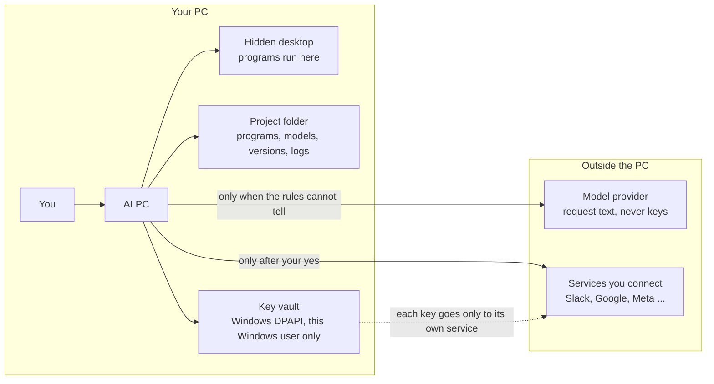

- The program lanes never use your mouse, keyboard or screen. Programs run on the hidden desktop, as invisible instances, in background mode, or with their windows parked off-screen.
- Anything others will see waits for your yes, with a preview of exactly what goes where.
- Keys are typed at a hidden prompt and kept in a vault encrypted with Windows DPAPI, so only your Windows user on this PC can read them. They are never printed, never logged and never sent to the model, and they are scrubbed from error messages.
- Local servers (the browser page, sign-in callbacks, test databases) listen on 127.0.0.1 only. The Telegram bridge answers only your own chat.
- Everything AI PC adds lives in the project folder: portable programs, models, caches, versions and output. The portable programs in `tools/` keep their settings there too, not in AppData.
- Every download is checked before use: the SHA-256 against the publisher's published value, and the signature (Authenticode or GPG) where the publisher signs. Installers are unpacked rather than run where possible, and Python packages go through [`scripts/safe_wheels.py`](scripts/safe_wheels.py) (PyPI's hash checked, the contents read, then an offline install).
- The desktop agent runs dry by default. Its own code, not the model, classifies every action; deleting, sending, buying and installing need your confirmation. It never controls terminals, password managers or the registry editor, and Ctrl+Alt+Q stops a live run. See [safety](docs/safety.md).

## Measured results

The integration suites drive the real programs on this PC, and use stand-ins only for online services. The latest
runs:

| Suite | What it covers | Result |
|---|---|---|
| `tests/unit` | Routing, file references, the command line, layers, the doctor; no programs needed (CI runs these) | 446 passed in about 15 s |
| `test_popular.py` | Over 40 desktop programs really run, from Godot and KiCad to PostgreSQL and the Android SDK | 180 of 180 |
| `test_apps.py` | 29 smaller programs, from OCR and PC care to statistics checked against textbook p-values | 103 of 103 in 27 s |
| `test_aipc.py` | The one chat: 45 requests routed, steps, references, the Telegram bridge, the browser page | 30 of 30 in 36 s |
| `test_bar.py` | The command bar on the hidden desktop: the combo, File Explorer's selection, voice, Yes and No | 52 of 52 in 25 s |
| `test_social.py` | Seven platforms' rules, the posting queue, retries and limits, against stand-ins | 127 of 127 |
| `test_accounts.py`, `test_accounts_systems.py` | The books, and five accounting systems, including lost answers and failures part-way | 52 of 52, 81 of 81 |
| `test_design2code.py` | Figma and Canva designs to web pages, measured against the design | 96 of 96 |
| `test_hub.py` | Eight work services: exact requests, nothing outward without a yes, read-backs, undo | 58 of 58 in 0.2 s |
| `test_win.py` | Windows files and settings, the Recycle Bin round trip, zip safety | 38 of 38 in 9 s |
| A ten-genre video batch | Ten one-minute videos from stock footage, all exported (about 3.3 minutes and $0.009 each) | Asks: 57 met, 21 partly, 0 missed. Edit-point checks: 569 pass, 88 warn, 15 fail, each named in the video's report |

Dates and details are on each program's page in [docs/programs](docs/programs).

## Getting started

You need Windows 11 (64-bit), [uv](https://docs.astral.sh/uv/) and Git. A Nebius API key is needed only for the
requests that need the model.

```powershell
git clone https://github.com/FareedKhan-dev/ai-pc.git
cd ai-pc
uv sync                                    # .venv with Python 3.12 and the exact versions in uv.lock
uv run ai-pc keys set NEBIUS_API_KEY       # typed at a hidden prompt, kept in the encrypted vault
uv run ai-pc doctor                        # every program, model and package it uses: present or missing, with versions
```

Then:

```powershell
uv run ai-pc chat                                       # the chat in the terminal
uv run ai-pc chat -m "make my photo brighter" --file car.jpg
uv run ai-pc bar --shortcut                             # makes AI PC.lnk; pin it to Start
uv run ai-pc bar                                        # then press Ctrl+Alt+Space in any program
uv run ai-pc video --help                               # each program also has its own command
```

| Command | Purpose |
|---|---|
| `ai-pc chat` | The chat: requests, files and voice notes |
| `ai-pc bar` | The Ctrl+Alt+Space bar (hold the keys to talk) |
| `ai-pc web`, `ai-pc telegram` | The chat in a browser on this PC, or through your own Telegram bot |
| `ai-pc video`, `office`, `photo`, `sound`, `design`, `cad`, `3d`, `convert`, `windows`, `code`, `accounts`, `hub`, `social`, `apps` | One program at a time |
| `ai-pc agent` | The desktop agent, for programs that can only be used through their interface |
| `ai-pc keys` | API keys in the encrypted vault |
| `ai-pc doctor` | Checks that every program, model and package it uses is on this PC |

[Getting started](docs/getting-started.md) covers the details, and [configuration](docs/configuration.md) covers keys,
data folders and model choices.

## Under the hood

```
ai-pc/
├── src/ai_pc/
│   ├── cli/            the ai-pc command, one module per subcommand
│   ├── assistant/      the chat, routing, file references, the bar, the browser page, Telegram, voice notes
│   ├── video/ office/ photo/ sound/ design/ cad/ three/ convert/ windows/ coding/ accounts/ hub/ social/
│   │                   one package per program: request rules, a builder, checks, a chat with versions
│   ├── apps/           88 smaller programs, one module each
│   ├── desktop/        the desktop agent: UI Automation, skills, safety checks, click models
│   ├── llm/            the model client, planners, prompts
│   ├── media/          audio, speech (local Whisper), frames, generated music and sound effects
│   └── core/           configuration, paths, keys and the vault, the hidden desktop, the headless browser
├── tests/unit/         fast tests that need none of the programs (CI)
├── tests/integration/  suites that drive the real programs (pytest -m integration)
├── services/tinyclick/ the TinyClick click-model server, in its own GPU environment
├── scripts/            benchmarks, the wheel checker, the README's pictures
└── docs/               guides, a page per program, decision records
```

Imports only go down these layers, and [`tests/unit/test_layers.py`](tests/unit/test_layers.py) fails if one goes up:

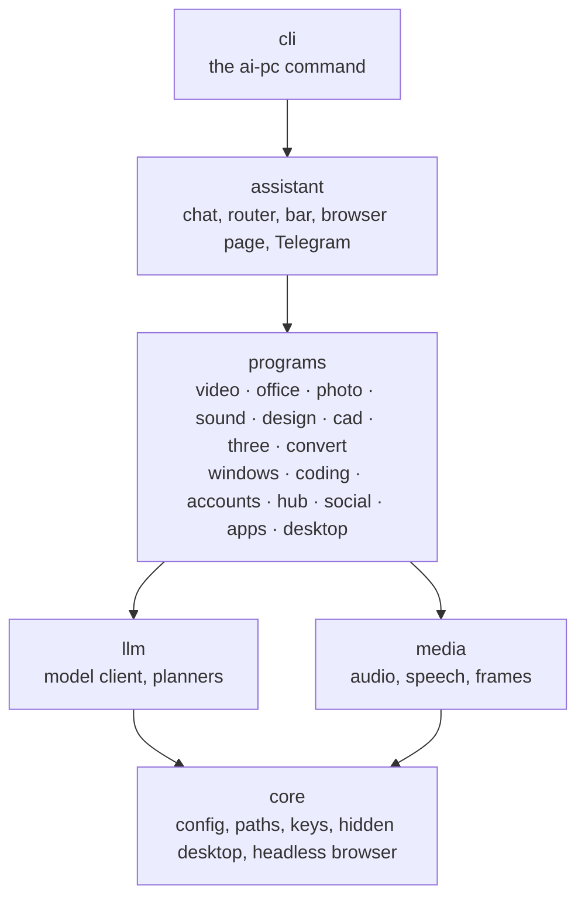

The big choices are written down as [decision records](docs/adr/README.md): everything in the project folder, programs
driven through their files and interfaces, rules first with a low-cost model, and one package with one command.

## Development

```powershell
uv run pytest                     # unit tests, about 15 s
uv run pytest -m integration      # the suites that drive the real programs (slow)
uv run ruff check .
uv run ruff format --check .
uv run mypy
```

CI runs lint, the type check, the unit tests, a gitleaks secret scan and a build on every push. Commits follow
[Conventional Commits](https://www.conventionalcommits.org). See [CONTRIBUTING.md](CONTRIBUTING.md) and
[docs/development.md](docs/development.md), which also explains how to add a program.

## Documentation

| Page | What it covers |
|---|---|
| [Getting started](docs/getting-started.md) | Setting up a PC, the key, first commands |
| [Configuration](docs/configuration.md) | Keys, where data lives, settings files, models |
| [Architecture](docs/architecture.md) | How the pieces fit, the repository layout, the rules every program follows |
| [The chat and the command bar](docs/assistant.md) | One conversation for everything, from the terminal, the bar, the browser or Telegram |
| [The desktop agent](docs/desktop-agent.md) | Operating any Windows program through its interface, and learning skills |
| [Programs](docs/README.md#the-programs) | A page for each program lane |
| [Tools](docs/tools.md) | The portable programs in `tools/`, and how each was checked |
| [Safety](docs/safety.md) | What the agents will never do, and how that is enforced |

## Security

Please report security problems privately; see [SECURITY.md](SECURITY.md).

## License and trademarks

Copyright (c) 2026 FareedKhan-dev. All rights reserved. See [LICENSE](LICENSE). Third-party components are listed in
[THIRD_PARTY_NOTICES.md](THIRD_PARTY_NOTICES.md).

Program names and logos belong to their owners. They appear here only to name the programs AI PC works with; this
project is not affiliated with or endorsed by any of them. Where each logo came from is listed in
[docs/assets/logos/SOURCES.md](docs/assets/logos/SOURCES.md).

[^osworld]: Xie et al., "OSWorld: Benchmarking Multimodal Agents for Open-Ended Tasks in Real Computer Environments", 2024. <https://arxiv.org/abs/2404.07972>
[^osworld-verified]: OSWorld-Verified leaderboard, results file of 7 August 2026. <https://os-world.github.io/>
[^osworld-human]: "OSWorld-Human: Benchmarking the Efficiency of Computer-Use Agents", MLSys 2026. <https://arxiv.org/abs/2506.16042>
[^osexpert]: "OSExpert", 2026, table 3. <https://arxiv.org/abs/2603.07978>
[^openai-vision]: OpenAI, "Images and vision" guide: tile-based models count a 1920x1080 picture as 1,105 tokens, patch-based models as about 2,450. <https://developers.openai.com/api/docs/guides/images-vision>
[^gemini-res]: Google, Gemini API "Media resolution": 1,120 tokens per image by default, 2,240 at the resolution it recommends for computer use. <https://ai.google.dev/gemini-api/docs/media-resolution>
[^screenspot-pro]: "ScreenSpot-Pro: GUI Grounding for Professional High-Resolution Computer Use", 2025 <https://arxiv.org/abs/2504.07981>, and its leaderboard, updated 10 September 2026 <https://gui-agent.github.io/grounding-leaderboard/>
[^waa-v2]: "Efficient Agent Training for Computer Use" (WindowsAgentArena-V2: screenshots only, 1280x720, 30 steps), 2025. <https://arxiv.org/abs/2505.13909>
[^osworld2]: OSWorld 2.0, long-horizon workflows, 2026. <https://arxiv.org/abs/2606.29537>
[^ufo2]: UFO2, Microsoft, 2025. <https://arxiv.org/abs/2504.14603>
[^coact]: CoAct-1, ICLR 2026. <https://arxiv.org/abs/2508.03923>
